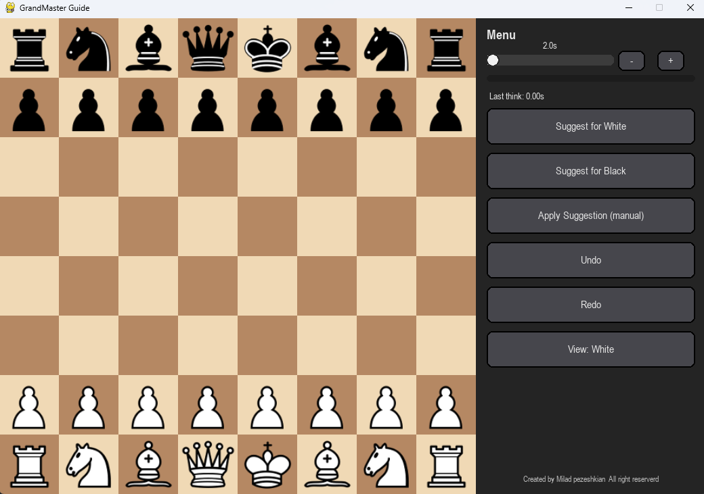
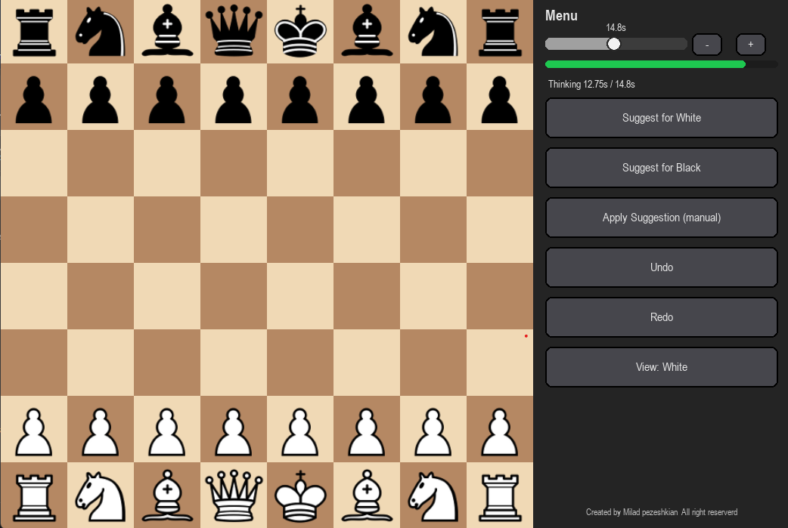
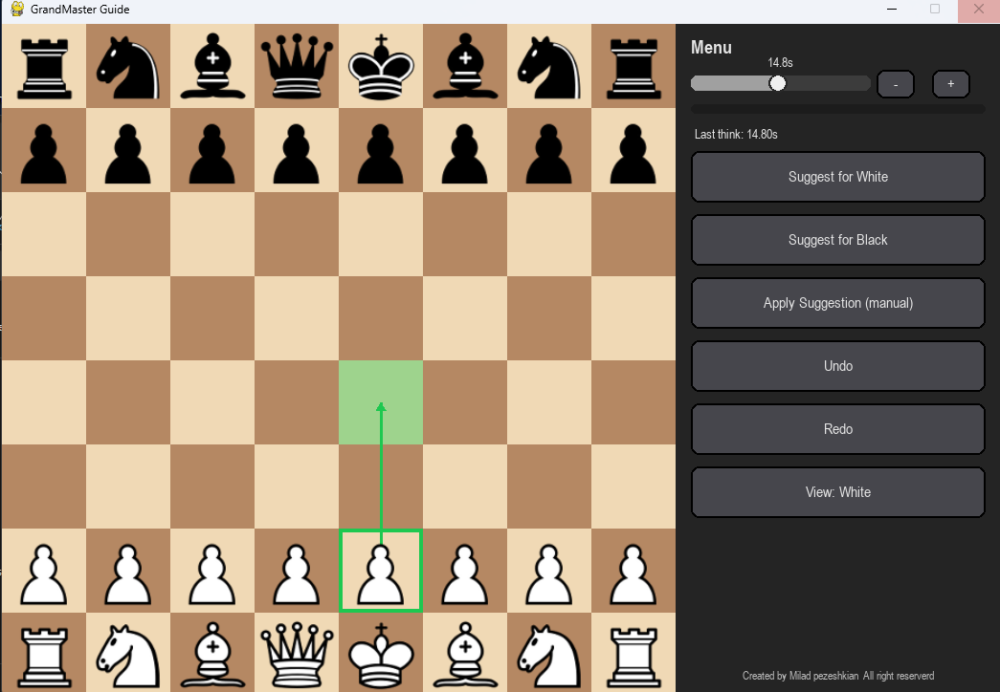

# GrandMaster Guide — README

**GrandMaster Guide** — a lightweight PyGame GUI for playing and analyzing chess using a UCI engine (Stockfish or any other UCI‑compatible engine).  
This README explains how to install required Python packages, where to download Stockfish, how to package the app into a Windows `.exe`, and common troubleshooting tips.

---

## Table of Contents
- [Requirements](#requirements)  
- [Quick install (development)](#quick-install-development)  
- [Download Stockfish (recommended)](#download-stockfish-recommended)  
- [Packaging with PyInstaller](#packaging-with-pyinstaller)  
- [Running the app](#running-the-app)  
- [Troubleshooting](#troubleshooting)  
- [Credits & License](#credits--license)

---

## Screenshots






---

## Requirements

- **Python 3.8+** (recommended).  
- Python packages used by the project:

```bash
pip install pygame python-chess
# Optional (for packaging)
pip install pyinstaller
```

- A UCI engine such as **Stockfish** (binary for your platform).

---

## Quick install (development)

1. Create & activate a virtual environment (recommended):

```bash
python -m venv .venv
# Windows
.venv\Scripts\activate
# macOS / Linux
source .venv/bin/activate
```

2. Upgrade pip and install dependencies:

```bash
pip install -U pip
pip install pygame python-chess
```

3. Place `main.py` in your project folder. During development the app will attempt to download piece images into a `pieces/` folder if it is missing. You can optionally create a `pieces/` folder with PNG piece images.

---

## Download Stockfish (recommended)

Stockfish is a top-tier open-source UCI engine. Download official binaries from the Stockfish website or GitHub releases:

- **Official download page:** https://stockfishchess.org/download/  
- **GitHub releases:** https://github.com/official-stockfish/Stockfish/releases

**Important notes:**
- Choose the binary that matches your platform (Windows/macOS/Linux) and CPU capabilities (e.g. AVX2).  
- If you plan to bundle the engine with a Windows `.exe`, rename the binary to `stockfish.exe` (the provided `main.py` looks for that filename by default).  
- Stockfish is a command-line engine (no graphical interface) and is meant to be used by GUIs like this one.

---

## Packaging with PyInstaller

To create a distributable Windows app, use **PyInstaller**. The provided `main.py` includes logic to run Stockfish without popping a console window on Windows (it uses `CREATE_NO_WINDOW` when available). Use `--windowed` so your GUI runs without an attached console.

Example build commands:

- **One-directory build (recommended for testing)**

```bash
pyinstaller --onedir --windowed \
  --add-data "pieces;pieces" \
  --add-binary "stockfish.exe;." \
  --icon "app.ico" \
  main.py
```

- **Single-file build (convenient to distribute)**

```bash
pyinstaller --onefile --windowed \
  --add-data "pieces;pieces" \
  --add-binary "stockfish.exe;." \
  --icon "app.ico" \
  main.py
```

Notes:
- On macOS/Linux replace Windows-style `--add-data` separator `;` with `:` (example: `"pieces:pieces"`).  
- `--windowed` / `--noconsole` produces a GUI app without a console.  
- `--add-binary "stockfish.exe;."` bundles the engine next to the executable so the app can find and start it at runtime.

---

## Running the app

- **During development:**

```bash
python main.py
```

The app attempts to locate `stockfish.exe` in these places (in order): bundled resource folder (when frozen), the same directory as the executable, or the system `PATH`. If it cannot find an engine, the GUI still opens — engine-assisted features will be disabled until a UCI binary is provided.

- **After packaging:**
  - Place `stockfish.exe` next to your packaged executable, or bundle it using `--add-binary` as shown above.
  - Launch the `.exe`. The GUI will appear and the engine runs headless in the background (no extra console window) when built with the recommended options.

---

## Troubleshooting

- **Black console appears for Stockfish (Windows):**  
  Ensure you packaged an actual `stockfish.exe` binary (not a wrapper script) and that PyInstaller used `--windowed`. The included `main.py` already attempts to use `CREATE_NO_WINDOW` to prevent the child console from appearing.

- **Engine not found:**  
  Verify `stockfish.exe` is next to your `.exe` or available on the system `PATH`. You can also edit `find_stockfish()` in `main.py` to add custom lookup paths.

- **ImportError / Module not found:**  
  Make sure dependencies are installed into the interpreter/environment you run the program with (`pip install python-chess pygame`).

- **Pygame installation issues:**  
  Try upgrading `pip` and installing prebuilt wheels. See https://www.pygame.org/wiki/GettingStarted for platform-specific tips.

---

## Credits & License

- **Author / Footer:** Created by Milad Pezeshkian — All rights reserved.  
- **Engine:** Stockfish — GPL licensed. Official site: https://stockfishchess.org/ and https://github.com/official-stockfish/Stockfish/releases  
- **Libraries:** `pygame`, `python-chess`, `pyinstaller` (used for packaging)

---

## Final notes

- Rename your downloaded Stockfish binary to `stockfish.exe` if you plan to bundle it with the Windows executable — or update `find_stockfish()` in `main.py` to point to a different name/location.  
- The provided `main.py` runs the engine in the background (no separate console) when used together with a Windows Stockfish binary and building with `--windowed` / `--noconsole`.  
- Enjoy analyzing and playing — good luck and have fun! 🎯

---

