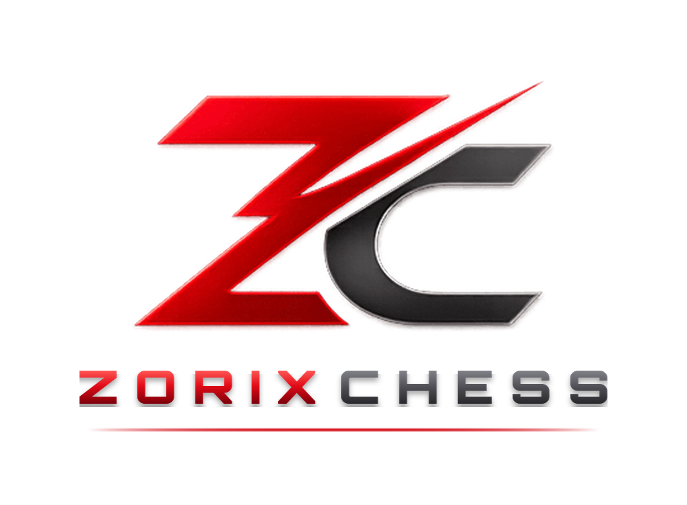
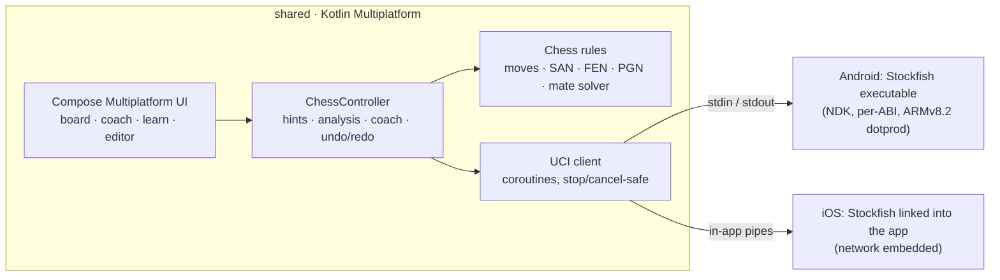
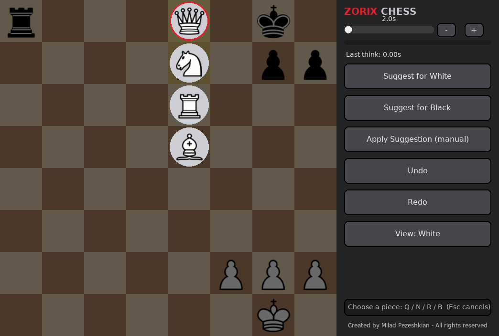

<p align="center">
  
</p>

<p align="center">
  <b>Learn chess from zero with a personal coach that knows your name, explains every move and talks to you — plus the best move in any position. Powered by Stockfish 19, entirely on your device.</b><br>
  Android · iOS · Windows / macOS / Linux
</p>

<p align="center">
  <a href="../../releases"></a>
  
  
</p>

<p align="center">
  <a href="#english">English</a> · <a href="#فارسی">فارسی</a>
</p>

| Splash | Best move | Live analysis | Promotion | Persian (RTL) |
|:---:|:---:|:---:|:---:|:---:|
|  |  |  |  |  |

---

## English

**Zorix Chess** (formerly *GrandMaster Guide*) is a chess analysis app that tells you the strongest move in any
position. It uses **Stockfish 19**, the world's strongest open-source chess engine, and runs it **on the device itself**:
no account, no server, no internet connection — the Android app does not even request the internet permission.

### Download

| Platform | Package | Requirements |
|---|---|---|
| **Android** | `ZorixChess-*-android.apk` from [**Releases**](../../releases) | Android 8.0+ (arm64, armv7, x86_64) |
| **iOS / iPadOS** | `ZorixChess-*-ios-unsigned.ipa` from [**Releases**](../../releases) | iOS 15+, installed with Sideloadly / AltStore or your own signing certificate |
| **Desktop** | `main.py` (Python) | Windows, macOS or Linux with Python 3.8+ and a Stockfish binary |

> **Installing the iOS build.** Apple only runs signed apps. The published IPA is unsigned, so install it with
> [Sideloadly](https://sideloadly.io) or [AltStore](https://altstore.io) (both work from Windows) using your Apple ID,
> or re-sign it with an Apple Developer certificate. Distribution through the App Store requires an Apple Developer account.

### Features

| | |
|---|---|
| 🧑‍🏫 **Personal coach** | You enter your name and level on first launch; the coach talks to you by name. Every move is rated (**Brilliant !!, Great !, Best ★, Excellent, Good, Book, Inaccuracy ?!, Mistake ?, Miss, Blunder ??**) and explained: what it attacks or leaves hanging, the threat behind the opponent's move, the better move and the line the engine expects next. |
| 🔊 **Coach voice** | Explanations, lessons and warnings are read aloud. Persian uses a neural voice that runs on the device ([sherpa-onnx](https://github.com/k2-fsa/sherpa-onnx) + Piper), English the system voice. |
| 📚 **310 lessons** | Six step-by-step courses from zero — Basics, Checkmate Patterns, Tactics, Endgames, Openings (principles, traps, a full repertoire and memory drills) and Strategy — with stars and progress. Every exercise is verified with the chess rules and the engine. |
| ⚔️ **Play Zorix** | 20 levels from 250 to 3200 Elo, a personal rating, unlockable levels, hints, take-backs and a coach that explains the bot's moves and warns about its threats. |
| 📈 **Game review** | Accuracy for both sides, key moments and "retry" to find the better move yourself. |
| 🧩 **Puzzles** | 709 rated puzzles with a puzzle rating, streak mode and theme training (forks, pins, skewers, mates…). |
| 🎯 **Best move** | Stockfish searches the position for an adjustable time (0.5 – 30 s) and shows the move as an arrow, with its evaluation (`+1.25`, `#3`) and the expected continuation. One tap plays it. |
| 📈 **Live analysis** | Continuous analysis with up to three candidate lines, colour-coded arrows, depth and speed, plus an evaluation bar. |
| ♛ **Correct promotion** | A pawn reaching the last rank opens a picker for **Queen, Knight, Rook or Bishop** — no more automatic queening. |
| ✋ **Natural input** | Tap-tap or drag-and-drop, legal-move hints, smooth move animations, check and last-move highlights, board flip. |
| ♟️ **Any position** | Visual position editor (pieces, side to move, castling rights) with live validation that explains what is wrong, FEN import/export, PGN copy and share. |
| ⏮️ **Game navigation** | Undo / redo, a scrollable move list with jump-to-move, automatic game-over detection (mate, stalemate, repetition, 50 moves, insufficient material). |
| 🎨 **Design** | Dark theme in the Zorix brand colours, animated intro, five board themes, phones, tablets and landscape. |
| 🌐 **Languages** | English, Persian (فارسی) and Kurdish Sorani (کوردی), selectable in the app, with a complete right-to-left layout (chess notation always stays left-to-right). |
| 💾 **Private & offline** | Settings and the current game are stored locally; nothing ever leaves the device. |

### Architecture


```mermaid
flowchart LR
    subgraph shared["shared · Kotlin Multiplatform"]
        UI["Compose Multiplatform UI<br/>board · coach · learn · editor"] --> C["ChessController<br/>hints · analysis · coach · undo/redo"]
        C --> R["Chess rules<br/>moves · SAN · FEN · PGN · mate solver"]
        C --> U["UCI client<br/>coroutines, stop/cancel-safe"]
    end
    U -->|"stdin / stdout"| A["Android: Stockfish executable<br/>(NDK, per-ABI, ARMv8.2 dotprod)"]
    U -->|"in-app pipes"| I["iOS: Stockfish linked into the app<br/>(network embedded)"]
```

- **One codebase for both phones.** The chess rules, the engine protocol, the app logic and the whole UI live in
  `mobile/shared` and are shared by Android and iOS.
- **Stockfish on Android** is compiled from source with the NDK into standalone executables for every ABI
  (plus an ARMv8.2 dot-product build selected automatically on newer phones) and driven over UCI.
- **Stockfish on iOS** runs on a background thread inside the app, because iOS does not allow launching separate
  processes; its standard input and output are connected to pipes.
- **Quality:** the move generator is verified with the standard *perft* suites; unit tests cover SAN/FEN/PGN, the
  promotion flow, the UCI client, the coach's explanations, play against Zorix and the full hint/analysis flow against a
  real Stockfish; every lesson exercise and puzzle is re-checked with the app's own chess rules. The lesson content is
  generated and engine-verified by the scripts in `mobile/content/tools`.

### Project layout

```
mobile/                 Android Studio / Gradle project (open this folder)
  shared/               Kotlin Multiplatform: rules, UCI client, controller, Compose UI, resources (en/fa/ckb)
  androidApp/           Android application
  iosApp/               iOS application (XcodeGen project, SwiftUI host, Stockfish bridge)
  buildSrc/             Gradle tasks that compile Stockfish with the NDK and provide its network
  stockfish/            Unmodified Stockfish 19 sources (GPLv3)
  branding/             Logo, fonts, piece artwork and the asset generator
main.py                 Desktop version (Python / PyGame)
.github/workflows/      CI: builds the APK and the IPA and publishes them as a release
```

### Build from source

**Android** — Android Studio Ladybug (2024.2) or newer
1. *File › Open* the **`mobile`** folder.
2. Install the NDK once: *Settings › Languages & Frameworks › Android SDK › SDK Tools › NDK (Side by side) 27.2*.
3. Select the `androidApp` configuration and press **Run**.

The first build compiles Stockfish (a few minutes) and downloads its neural network (~94 MB) once into
`mobile/stockfish/nets/`. Details and options: [mobile/README.md](mobile/README.md).

**iOS** — a Mac with Xcode 16 (or use the GitHub Actions workflow, which needs no Mac)
```bash
brew install xcodegen
cd mobile/iosApp && xcodegen generate && open ZorixChess.xcodeproj
```
Choose your team under *Signing & Capabilities* and run on an iPhone. The Xcode build calls Gradle, which compiles
the shared Kotlin code and Stockfish for iOS automatically.

**Automated builds** — every push that touches `mobile/` runs [`release.yml`](.github/workflows/release.yml):
unit tests, the Android APK, the iOS IPA and a GitHub release containing both.

---

## Desktop version (Python)

The original desktop app, now also branded **Zorix Chess**: a PyGame board with Stockfish suggestions for either side,
an adjustable think time, undo/redo, board flip, PGN export (`Ctrl+S`) and the same promotion picker
(click a piece or press **Q / N / R / B**, **Esc** cancels).

<p align="center"></p>

```bash
pip install pygame python-chess
python main.py
```

Put a Stockfish binary next to `main.py` (`stockfish.exe` on Windows, `stockfish` elsewhere) or on your `PATH`;
download it from [stockfishchess.org](https://stockfishchess.org/download/). Without an engine the board still works.

**Windows executable** (PyInstaller):
```bash
pip install pyinstaller
pyinstaller --onefile --windowed --add-data "pieces;pieces" --add-data "assets;assets" ^
  --add-binary "stockfish.exe;." --icon "assets/zorix_chess.ico" main.py
```
On macOS/Linux use `:` instead of `;` in `--add-data`. Keyboard shortcuts: `Z` undo, `Ctrl+Z` undo two plies,
`Ctrl+Y` redo, `C` cancel thinking, `Ctrl+S` save PGN.

---

## فارسی

<div dir="rtl">

**Zorix Chess** (نام قبلی: *GrandMaster Guide*) برنامه‌ای برای تحلیل شطرنج است که در هر وضعیتی **بهترین حرکت** را
نشان می‌دهد. موتور آن **Stockfish 19**، قوی‌ترین موتور شطرنج متن‌باز دنیا، است و **روی خود دستگاه** اجرا می‌شود؛
بدون حساب کاربری، بدون سرور و **بدون نیاز به اینترنت**.

### دانلود
از صفحه‌ی [**Releases**](../../releases) دانلود کنید:

- **اندروید (نسخه‌ی ۸ به بالا):** فایل `android.apk` را روی گوشی باز کنید و اجازه‌ی «نصب از منابع ناشناس» را بدهید.
- **آیفون و آیپد (iOS 15 به بالا):** فایل `ios-unsigned.ipa` امضا نشده است. آن را با **Sideloadly** یا **AltStore**
  (روی ویندوز هم کار می‌کنند) و Apple ID خودتان نصب کنید، یا با گواهی Apple Developer امضا کنید.
  انتشار در App Store به حساب Apple Developer نیاز دارد.
- **دسکتاپ:** فایل `main.py` با پایتون (راهنما در بخش انگلیسی بالا).

### امکانات
- **مربی شخصی:** در اولین اجرا اسم و سطح‌تان را وارد می‌کنید و مربی با اسم خودتان صحبت می‌کند. هر حرکت ارزیابی می‌شود (درخشان، عالی، بهترین، خوب، کتابی، نادقیق، اشتباه، از دست رفته، اشتباه فاحش) و دلیلش توضیح داده می‌شود: تهدیدها، مهره‌های بی‌دفاع، حرکت بهتر و پیش‌بینی ادامه‌ی بازی.
- **صدای مربی:** توضیحات و درس‌ها با صدای طبیعی فارسی خوانده می‌شوند؛ صدا روی خود گوشی و بدون اینترنت ساخته می‌شود.
- **۳۱۰ درس تعاملی در ۶ دوره** قدم‌به‌قدم از صفر: مبانی، الگوهای مات، تاکتیک، آخربازی، گشایش‌ها و استراتژی؛ همه‌ی تمرین‌ها با قوانین شطرنج و موتور بررسی شده‌اند.
- **بازی با Zorix در ۲۰ سطح** با ریتینگ شخصی، باز شدن سطح‌ها، راهنما و توضیح حرکت‌های ربات؛ و **بررسی بازی** با دقت، لحظه‌های کلیدی و «دوباره امتحان کن».
- **۷۰۹ معمای ریتینگ‌دار**، حالت پشت سر هم و تمرین بر اساس موضوع.
- **بهترین حرکت** با زمان فکر قابل تنظیم (۰٫۵ تا ۳۰ ثانیه)، فلش روی صفحه، ارزیابی و ادامه‌ی خط؛ با یک لمس اجرا می‌شود.
- **تحلیل زنده** تا سه خط هم‌زمان، با فلش‌های رنگی و نوار ارزیابی.
- **ارتقای درست سرباز:** انتخاب وزیر، اسب، رخ یا فیل (دیگر خودکار وزیر نمی‌شود).
- حرکت با **لمس یا کشیدن**، نمایش حرکت‌های مجاز، انیمیشن، برگشت و جلو، لیست حرکت‌ها و چرخش صفحه.
- **چیدن هر وضعیت دلخواه** با بررسی زنده و توضیح خطا، ورود و خروج FEN، کپی و اشتراک PGN.
- تشخیص خودکار پایان بازی (مات، پات، تکرار سه‌باره، قانون ۵۰ حرکت، کمبود مهره).
- طراحی تیره با رنگ‌های برند Zorix، اسپلش متحرک، ۵ رنگ صفحه، پشتیبانی از تبلت و حالت افقی.
- **فارسی، کوردی (سورانی) و انگلیسی** با چیدمان کامل راست‌به‌چپ؛ انتخاب زبان از تنظیمات.
- تنظیمات و بازی فعلی فقط روی خود دستگاه ذخیره می‌شوند.

### ساخت از سورس
- **اندروید:** پوشه‌ی **`mobile`** را در Android Studio باز کنید، یک بار NDK نسخه‌ی 27.2 را از SDK Manager نصب کنید و
  **Run** را بزنید. توضیحات کامل: [mobile/README.md](mobile/README.md)
- **iOS:** روی مک با Xcode 16: `xcodegen generate` در پوشه‌ی `mobile/iosApp` و سپس اجرا از Xcode.
  بدون مک هم GitHub Actions نسخه‌ی iOS را خودکار می‌سازد.

</div>

---

## Credits & license

- **Zorix Chess** app code, design and logo — © Milad Pezeshkian. All rights reserved.
- **Stockfish 19** — © the Stockfish developers, [GNU GPL v3](mobile/stockfish/Copying.txt). The complete engine
  source is included in [`mobile/stockfish`](mobile/stockfish). On iOS the engine is linked into the app, so
  distributions of the iOS build must comply with the GPL.
- **Coach voice** — [sherpa-onnx](https://github.com/k2-fsa/sherpa-onnx) (Apache 2.0, with ONNX Runtime, MIT, and
  espeak-ng, GPL v3) and the Piper voice *fa_IR amir* (MIT, trained on CC0 data).
- **Chess pieces** — Colin M.L. Burnett (*cburnett*), multi-licensed GFDL/BSD/GPL.
- **Orbitron** typeface — Matt McInerney / The League of Moveable Type, SIL Open Font License.
