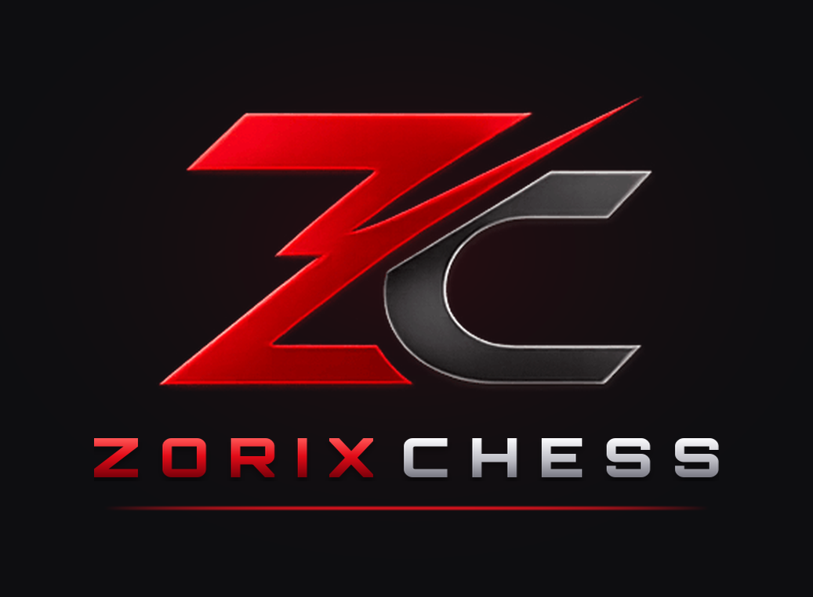
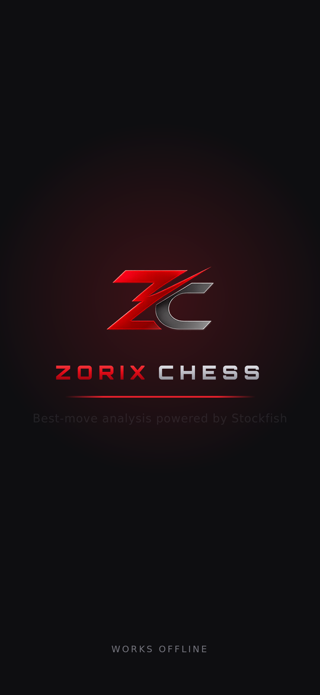
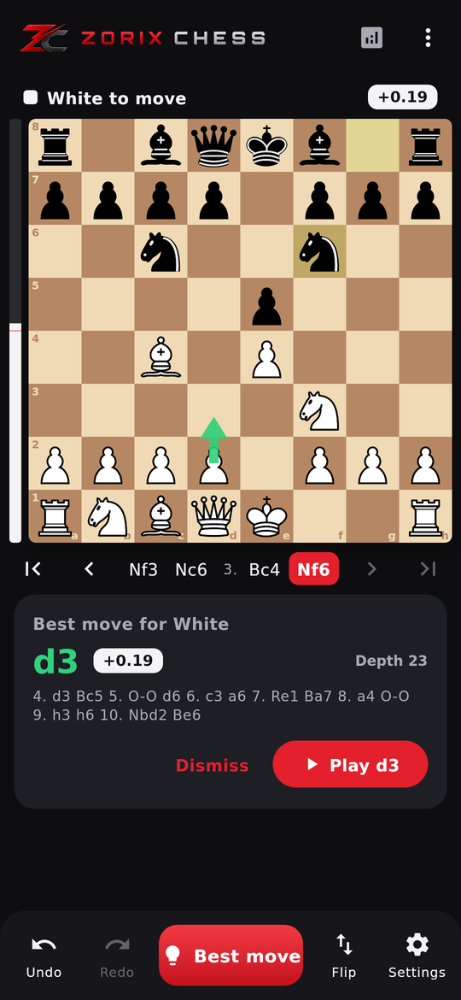
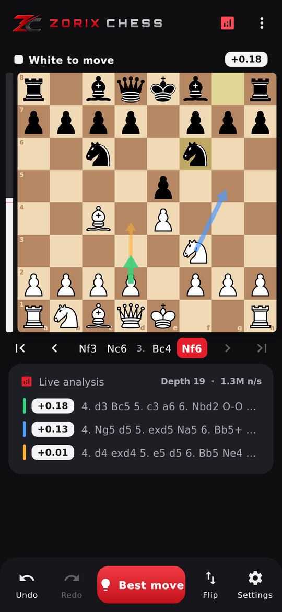
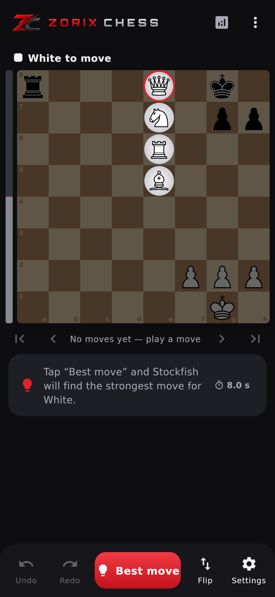
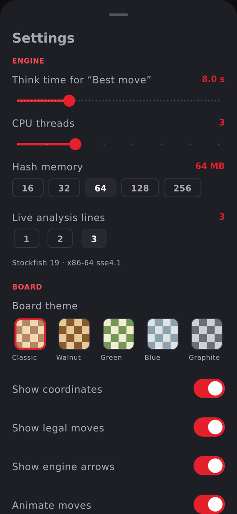
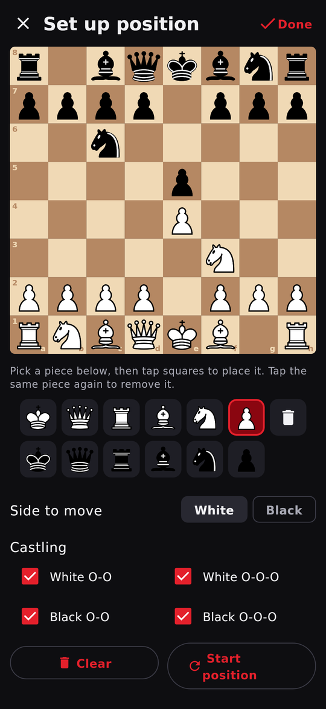
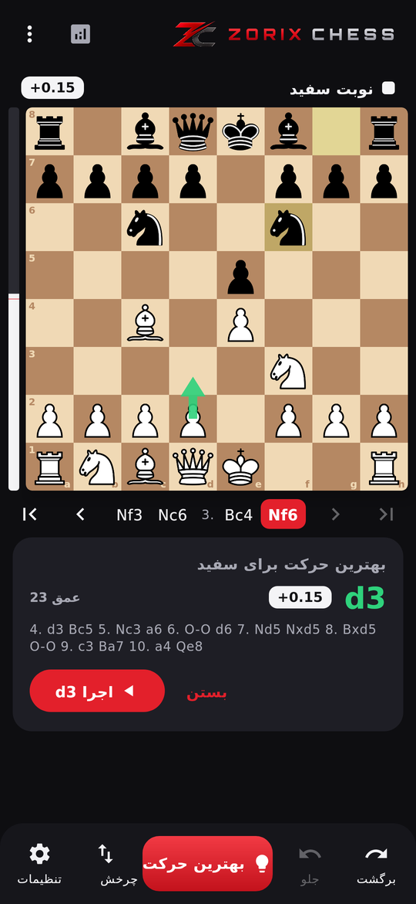

# Zorix Chess — Android & iOS

<p align="center"></p>

**Zorix Chess** finds the best move in any position with **Stockfish 19**.
The engine runs on the phone itself, so the app works **completely offline** (the Android app does not even request
internet permission). Android and iOS share one Kotlin Multiplatform codebase: chess rules, engine protocol, app logic and
the Compose UI all live in `shared/`.

| Splash | Best move | Live analysis | Promotion picker |
|---|---|---|---|
|  |  |  |  |

| Settings | Position editor | Persian (RTL) |
|---|---|---|
|  |  |  |

*(These are renders of the app's Compose UI.)*

---

## راهنمای فارسی

### ویژگی‌ها
- **بهترین حرکت** با Stockfish 19، با زمان فکر قابل تنظیم (۰٫۵ تا ۳۰ ثانیه، مثل نسخه‌ی دسکتاپ)، فلش روی صفحه، ارزیابی (+1.25 / #3) و ادامه‌ی خط
- **تحلیل زنده** با ۱ تا ۳ خط هم‌زمان و نوار ارزیابی
- **ارتقای سرباز درست**: وقتی سرباز به خانه‌ی آخر می‌رسد، پنجره‌ی انتخاب **وزیر، اسب، رخ یا فیل** باز می‌شود (دیگر خودکار وزیر نمی‌شود)
- حرکت با **لمس یا کشیدن** (drag & drop)، نمایش حرکت‌های مجاز، انیمیشن حرکت، برگشت/جلو، لیست حرکت‌ها، چرخش صفحه
- **چیدن وضعیت دلخواه**، بارگذاری/کپی FEN، کپی و اشتراک PGN
- ۵ رنگ صفحه، زبان فارسی و انگلیسی (راست‌به‌چپ کامل)، ذخیره‌ی خودکار بازی
- اسپلش‌اسکرین متحرک با لوگوی **ZORIX CHESS**
- **۱۰۰٪ آفلاین**: موتور و شبکه‌ی عصبی داخل خود APK هستند

### ساخت در Android Studio
1. **Android Studio** نسخه‌ی Ladybug (2024.2) یا جدیدتر را باز کنید، گزینه‌ی **Open** را بزنید و پوشه‌ی **`mobile`** همین مخزن را انتخاب کنید (نه ریشه‌ی مخزن).
2. **NDK** را نصب کنید (فقط یک بار):
   `Settings > Languages & Frameworks > Android SDK > SDK Tools` ← تیک **Show Package Details** ← زیر **NDK (Side by side)** نسخه‌ی **27.2.12479018** را انتخاب و **Apply** کنید.
   (اگر نسخه‌ی دیگری از NDK (r25 به بالا) نصب باشد، همان استفاده می‌شود.)
3. صبر کنید **Gradle Sync** تمام شود، پیکربندی **`androidApp`** را انتخاب کنید، گوشی (یا شبیه‌ساز) را وصل کنید و **Run ▶** را بزنید.

در **اولین** ساخت دو کار انجام می‌شود:
- Stockfish از سورس (`stockfish/src`) برای هر معماری کامپایل می‌شود (چند دقیقه؛ دفعات بعد کش می‌شود).
- شبکه‌ی عصبی Stockfish (`nn-1a298aa575a0.nnue`، حدود ۹۴ مگابایت) **یک بار** دانلود و در `stockfish/nets/` ذخیره می‌شود.
  اگر دانلود ممکن نبود، فایل را دستی از
  `https://tests.stockfishchess.org/api/nn/nn-1a298aa575a0.nnue`
  بگیرید و در پوشه‌ی `mobile/stockfish/nets/` بگذارید.

برنامه‌ی ساخته‌شده هیچ نیازی به اینترنت ندارد.

### ساخت فایل APK نهایی
- `Build > Build App Bundle(s) / APK(s) > Build APK(s)` یا در ترمینال: `gradlew assembleRelease`
- خروجی: `androidApp/build/outputs/apk/release/androidApp-release.apk`
- برای انتشار در کافه‌بازار/مایکت/گوگل‌پلی کلید امضای خودتان را در `gradle.properties` تعریف کنید (بخش `zorix.keystore`)؛ در غیر این صورت نسخه‌ی release با کلید debug امضا می‌شود تا قابل نصب باشد.

### نسخه‌ی iOS
- **بدون مک:** با هر push، GitHub Actions فایل IPA را می‌سازد و در صفحه‌ی Releases می‌گذارد. این فایل امضا نشده است؛
  با **Sideloadly** یا **AltStore** (روی ویندوز) و Apple ID خودتان نصبش کنید.
- **با مک و Xcode 16:** `brew install xcodegen` ← در پوشه‌ی `mobile/iosApp` دستور `xcodegen generate` ← باز کردن
  `ZorixChess.xcodeproj`، انتخاب Team در بخش Signing و اجرا روی آیفون.
- در iOS اجرای برنامه‌ی جداگانه ممنوع است، برای همین Stockfish داخل خود برنامه (روی یک thread جدا) اجرا می‌شود.

### نکات
- برای ساخت سریع‌تر روی گوشی واقعی، در `gradle.properties` مقدار `zorix.stockfish.abis=arm64-v8a` را بگذارید.
- شبیه‌ساز اندروید (x86_64) هم پشتیبانی می‌شود.
- حجم APK حدود ۸۰ مگابایت است (بیشترش شبکه‌ی عصبی Stockfish).

---

## English

### Build with Android Studio
1. Android Studio **Ladybug (2024.2) or newer** → **Open** → select this **`mobile`** folder.
2. Install the **NDK** once: *Settings › Languages & Frameworks › Android SDK › SDK Tools* → tick *Show Package Details* → **NDK (Side by side) 27.2.12479018** → Apply.
   Any installed NDK r25+ is used as a fallback.
3. Let Gradle sync, pick the **`androidApp`** run configuration, then **Run ▶** on a phone or emulator.

The first build compiles Stockfish from `stockfish/src` for every ABI (a few minutes, cached afterwards) and downloads the
NNUE network (~94 MB) **once** into `stockfish/nets/`. Without internet on the build machine, put
`nn-1a298aa575a0.nnue` there manually. The resulting app never needs the internet.

Release APK: `gradlew :androidApp:assembleRelease` → `androidApp/build/outputs/apk/release/`. Configure your own signing key in
`gradle.properties` (`zorix.keystore`, ...) before publishing.

### Build for iOS
- **Without a Mac:** every push runs `.github/workflows/release.yml`, which builds an unsigned IPA on a macOS runner
  and publishes it on the Releases page. Install it with Sideloadly or AltStore using your Apple ID.
- **With a Mac (Xcode 16):**
  ```bash
  brew install xcodegen
  cd mobile/iosApp && xcodegen generate && open ZorixChess.xcodeproj
  ```
  Select your team under *Signing & Capabilities* and run. The Xcode build phase calls
  `./gradlew :shared:embedAndSignAppleFrameworkForXcode`, which compiles the shared Kotlin code and, through
  `iosApp/stockfish/build_ios.sh`, Stockfish for iOS with its network embedded.

### How it works
```
shared/src/commonMain/kotlin/com/zorix/chess/
  core/          Chess rules: legal moves, castling, en passant, promotion, SAN, FEN, PGN (perft-verified)
  engine/uci/    UCI client (coroutines, stop/cancel safe) over an EngineConnection
  controller/    App logic (hints, live analysis, promotion flow, undo/redo, settings, session restore)
  ui/            Compose Multiplatform UI (board, splash, panels, settings, editor, dialogs)
shared/src/commonMain/composeResources/   Strings (en, fa), pieces, emblem, fonts
shared/src/androidMain/   ProcessConnection (Stockfish as a separate process)
shared/src/iosMain/       In-app Stockfish connection, iOS entry point (MainViewController)
androidApp/    Android shell: activity, splash theme, icons, network installer
iosApp/        iOS shell: XcodeGen project, SwiftUI host, launch screen, Stockfish bridge (C++)
buildSrc/      Gradle tasks: compile Stockfish with the NDK, provide the NNUE asset
stockfish/     Unmodified Stockfish 19 sources (GPLv3)
branding/      Logo source, fonts, piece SVGs and generate_assets.py (regenerates icons/splash)
```

- Stockfish is compiled into standalone executables named `libstockfish.so` (plus `libstockfish_dotprod.so`,
  used automatically on ARMv8.2+ phones for extra speed). They are packaged as native libraries so Android allows
  executing them, and the app talks to them over UCI exactly like the desktop version talks to `stockfish.exe`.
- The neural network ships once as an asset (not embedded per ABI) and is copied to private storage on first launch.
- Unit tests (`shared/src/androidUnitTest`, run with `gradlew :shared:testDebugUnitTest`) cover perft, SAN/FEN/PGN, the promotion flow and the UCI client. The engine
  integration tests run when you pass `-Dstockfish.path=<binary>` and are skipped otherwise.

### Gradle properties (`gradle.properties`)
| Property | Default | Meaning |
|---|---|---|
| `zorix.stockfish.abis` | `arm64-v8a,armeabi-v7a,x86_64` | ABIs to build the engine for |
| `zorix.ndkVersion` | `27.2.12479018` | Preferred NDK version |
| `zorix.stockfish.api` | `26` | API level the engine is compiled for |
| `zorix.keystore`, `zorix.keystorePassword`, `zorix.keyAlias`, `zorix.keyPassword` | – | Release signing |

### Licenses
- **Stockfish** – GNU GPL v3 (`stockfish/Copying.txt`). If you distribute the APK, you must also make the Stockfish
  source available; it is included in this repository (`mobile/stockfish`). On Android, Zorix Chess runs Stockfish as a
  separate program, like the desktop version. On iOS the engine is linked into the app, so iOS distributions must
  comply with the GPL.
- **Chess pieces** – Colin M.L. Burnett (cburnett), BSD/GPL/GFDL multi-license.
- **Orbitron font** – SIL Open Font License (`branding/fonts/OFL.txt`).
- Zorix Chess app code and logo – © Milad Pezeshkian, all rights reserved.
